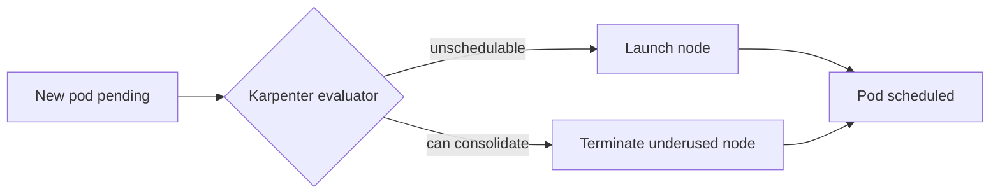

# Phase 9: Blog — 3 posts with correct card format — Research

**Researched:** 2026-04-26
**Domain:** Astro 5 Content Collections + markdown authoring + Claude Code skill design (multi-track)
**Confidence:** HIGH — 44 pre-locked CONTEXT decisions + 6/6 PASS UI-SPEC + direct verification of every open question against codebase, vault, docs, and installed skills

---

<user_constraints>
## User Constraints (from CONTEXT.md)

### Locked Decisions

**Track split — 3 waves, single phase**
- **D-01:** Phase 9 is a single phase with 3 sequential waves (Wave 1 = UI, Wave 2 = skill, Wave 3 = content).
- **D-02:** Waves sequential — no parallelization inside Phase 9.

**Content sourcing (Wave 3)**
- **D-03:** Combine vault analysis + skills history + reusable skill (Wave 2). Do NOT write from general knowledge.
- **D-04:** Confirmed vault sources per post (verified by researcher — see <phase_requirements> and Vault Asset Inventory).
- **D-05:** Exclude `10-AWS/11-Active-Clients/`, `14-Tips-AWS-Internal/`, `16-Amazon-Employer/`. Skill MUST hard-exclude these in vault search.

**Blog post structure**
- **D-06:** Per-topic length calibration — Karpenter ~1500-2500 words; MCP ~800-1200 words; Manifests ~700-1000 words.
- **D-07:** Template REQ-002 (300-600) is floor, not ceiling.

**Companion linking**
- **D-08 / D-09 / D-10:** Posts standalone OR link to companions; placement = end-of-post "Related" section, NOT in intro; skill includes `companion-link-check` step.

**Card format (Wave 1)**
- **D-11:** 4-row card (overline mono date / display title / body description / teal tag badges) — mirrors `PresentationCard.astro` (drop slug URL row).
- **D-12:** Tag badges teal: `bg-brand-primary-soft/30 border border-brand-primary/40 text-brand-primary font-mono text-[11px] font-semibold tracking-[0.08em] uppercase px-2 py-0.5 rounded`.
- **D-13:** Card container: `group flex flex-col p-6 rounded-xl bg-surface border border-border card-glow animate-on-scroll`.
- **D-14:** Whole-card `<a>` anchor wraps everything.

**Section + zebra rhythm**
- **D-15:** Section wrapper transparent (inherits `bg-bg-base`); drop current `bg-surface/30`.
- **D-16:** Container `max-w-[1120px] mx-auto px-6`.
- **D-17:** Section padding `py-20 sm:py-28`.
- **D-18:** Grid `grid grid-cols-1 sm:grid-cols-2 lg:grid-cols-3 gap-5`.
- **D-19:** "All posts →" = inline right-aligned header link `text-sm text-text-muted hover:text-brand-primary transition-colors whitespace-nowrap`.

**Component extraction**
- **D-20:** Extract `src/components/BlogCard.astro` with typed `CollectionEntry<'blog'>` props.

**Index + slug pages (Wave 1)**
- **D-21 / D-22:** `/blog/` index rewrites to 3-col `<BlogCard>` grid (no slice), flat date-desc, transparent section.
- **D-23:** Slug page — date overline mono xs, h1 `text-4xl sm:text-5xl tracking-[-0.02em]`, tags teal Badge.
- **D-24:** Slug page preserves `max-w-3xl` + prose-invert + back-link + Content component.

**Reading time + author (additive schema)**
- **D-25:** Schema tighten tags (required, was optional) + add `author` (default "Viktor Vedmich"), `reading_time` (optional number), `cover_image` (optional string).
- **D-26:** Existing `hello-world.md` already has tags ≥1 — no migration pain.
- **D-27:** Compute reading_time at build time if frontmatter absent (`Math.ceil(wordCount / 200)`).
- **D-28:** Byline `{author} · {reading_time} min read` / `{author} · {reading_time} мин чтения`.

**RU translation**
- **D-29:** Full RU body translation — 3 EN + 3 RU files, not frontmatter-only.
- **D-30:** Translation rules — tech terms stay English, natural RU prose, code identical, quotes stay original.
- **D-31:** Voice — tech-expert first-person, experience-grounded ("I've seen this fail in production").

**Skill `vv-blog-from-vault` (Wave 2)**
- **D-32:** Project-local at `.claude/skills/vv-blog-from-vault/`.
- **D-33:** Structure — SKILL.md + scripts/ + references/ + workflows/ (detailed tree in CONTEXT.md).
- **D-34:** Capabilities — vault search + session-recall + draft gen EN+RU + companion link check + visuals routing + verify+push.
- **D-35:** Triggers include Russian phrases ("новый пост", "статья из vault").
- **D-36:** Delegate to other skills (`mermaid-pro`, `excalidraw`, `art`, `viktor-vedmich-design`, `recall`); use MCP tools directly (QMD, episodic-memory).

**Visuals integration**
- **D-37:** `visuals-audit` heuristic (flow/sequence/pipeline → mermaid; metaphor → art; opinion → probably no visual).
- **D-38:** Asset storage `public/blog-assets/{slug}/`; mermaid blocks stay fenced — MUST verify Astro supports (see Q1 below).
- **D-39:** **Reuse opportunities FIRST** — karpenter-1000-clusters has 7 rendered PNG slides; reuse 2-3 inline in the Karpenter post.
- **D-40:** CSS/SVG animations allowed in posts but deferred to first real need. Zero JS.

**i18n**
- **D-41:** No new top-level keys in Wave 1 — `blog.title`, `blog.all_posts`, `back_to_home` already exist.
- **D-42:** New slug-page key `blog.min_read` (EN "min read" / RU "мин чтения"). UI-SPEC Q2 DROPPED the `blog.by_author` key.

**Publishing**
- **D-43:** CLAUDE.md publishing workflow — commit message `Post: <title>` (NO Co-Authored-By for content commits), push straight to `main`, ~2 min deploy.
- **D-44:** Image assets in `public/blog-assets/{slug}/` committed atomically with post markdown.

### Claude's Discretion

- Exact prose wording of the 3 posts (Wave 3) — skill drafts, user reviews after push
- mermaid diagram content for karpenter post — pick ONE illustrative flow (e.g., "Node consolidation loop" or "3 traps progression")
- Whether to use carousel rendered PNGs as inline images or generate fresh mermaid alternatives (preference: reuse per D-39)
- SKILL.md description text and trigger phrases wording
- Script languages for skill — Python preferred (matches `sync-claude-sessions` precedent, 100% stdlib for recall)
- Whether `reading_time` is `.optional()` computed-if-absent or `.default(null)` build-filled — planner decides
- Tag list refinement — start from REQ-002, refine during Wave 3 if skill suggests better tags based on vault content

### Deferred Ideas (OUT OF SCOPE)

- RSS feed (`@astrojs/rss`) — Phase 9.1 or next milestone
- Obsidian → blog auto-sync daemon — separate scope
- Tag filter / tag archive pages
- Pagination on `/blog/` index
- Reading progress indicator / TOC
- Cross-post / multi-site syndication
- Post cover image at card level — schema ready but not shown in card
- Animations in posts — enabled but deferred to first real need
- MDX migration — only if required
- Skill extraction to global `~/.claude/skills/vv-blog/`
- Companion auto-update watcher
</user_constraints>

<phase_requirements>
## Phase Requirements

| ID | Description | Research Support |
|----|-------------|------------------|
| **REQ-002** | 3 blog posts (EN + RU, 6 files total): `2026-03-20-karpenter-right-sizing.md`, `2026-03-02-mcp-servers-plainly-explained.md`, `2026-02-10-why-i-write-kubernetes-manifests-by-hand.md`. Each 300–600 words (floor per REQ-002; per-topic calibration allowed per D-06). Tags: `[kubernetes, aws, karpenter]`, `[ai, mcp, agents]`, `[kubernetes, opinion]`. Homepage BlogPreview shows 3 cards; slug pages render; all posts sourced from Obsidian vault where possible (via QMD). | **Karpenter:** 7 PNG slides + 7 HTML sources verified present in `45.20-Brand-Kit/carousel-templates/karpenter-1000-clusters/out/`; supporting notes `31-Work-AWS-DA-Role/31.80 AWS-Other-Resources/Innovate Karpenter.md` + `44-Speaking/44.20-Talk-Materials/DOP202-Warsaw-Summit-Speaker-Notes.md` exist. **MCP:** `44-Speaking/44.10-CFPs/15.31-Talks-Materials/2026-05-06-Warsaw-Summit-MCP-Chalk-Talk.md` exists (4.5K, session DOP202, 2026-05-06). **Manifests:** 13 diary files in `25-diary/25.70-Claude-Summaries/` from 2026-04-12 through 2026-04-26 confirmed. Skill delivers reusable pipeline (Wave 2). Card format delivered via Wave 1 (BlogCard + index + slug). |
</phase_requirements>

---

## Summary

Phase 9 is a well-scoped three-wave phase with 44 pre-locked decisions from `/gsd-discuss-phase` and a 6/6-PASS UI-SPEC. Research confirms every referenced asset exists (karpenter carousel slides, MCP Warsaw chalk-talk note, 13 diary files for the manifests post, all delegation-target skills). The technical stack is stable — Astro 5.17.1 + Tailwind 4.2.1 + Zod — and Phase 8's PresentationCard is a direct 4-row template with its teal-badge alpha utilities already proven in production.

The few remaining unknowns all resolve to standard Astro recipes: **mermaid** via `markdown.syntaxHighlight.excludeLangs` (Astro 5 built-in) + optional `rehype-mermaid`; **reading-time** via the official remark plugin recipe; **public-folder images** via standard markdown ``. The schema tightening (tags required) is non-breaking for the one existing post. The Wave 2 skill is structurally a hybrid of `vv-carousel` (vault-grounded, QMD MCP direct calls, brand-specific) and `sync-claude-sessions` (Python scripts, workflow-driven, project-local-friendly layout).

**Primary recommendation:** Plan this as 3 sequential waves per CONTEXT. In Wave 1, follow the Phase 8 `PresentationCard` pattern line-for-line (drop the slug URL row). In Wave 2, model the skill on `vv-carousel` for vault grounding + `sync-claude-sessions` for script-driven workflow; delegate diagrams to `mermaid-pro` but call QMD and episodic-memory as MCP tools directly. In Wave 3, reuse karpenter carousel PNGs (copy to `public/blog-assets/2026-03-20-karpenter-right-sizing/`), author to D-06 word counts, translate RU per D-30. Adopt the **official Astro reading-time remark recipe** over a custom helper — it's the idiomatic path and removes build-time logic from slug pages.

---

## Architectural Responsibility Map

| Capability | Primary Tier | Secondary Tier | Rationale |
|------------|-------------|----------------|-----------|
| BlogCard rendering | Astro SSG (component) | — | Component compiles to static HTML at build; zero JS shipped |
| Reading-time computation | Astro build plugin (remark) | — | Runs once during markdown → HTML transform; exposes via `remarkPluginFrontmatter.minutesRead` [CITED: docs.astro.build/recipes/reading-time] |
| Content queries (getCollection) | Astro SSG (page script) | — | Build-time; Zod validates; result is static props |
| Markdown → HTML | Astro markdown pipeline (Shiki + remark + rehype) | — | All code highlighting + mermaid handling via markdown config in `astro.config.mjs` |
| Image assets | `public/` folder | — | Static assets served as-is; markdown references with root-relative path `/blog-assets/...` [CITED: docs.astro.build/guides/images] |
| i18n string lookups | `src/i18n/utils.ts` (`t(locale)`) | — | Pure JS map; no runtime deps; bilingual rule enforced by file structure |
| Vault search (skill) | QMD MCP tool | Bash grep fallback | QMD MCP (`mcp__qmd__query`, `mcp__qmd__search`) is local CLI + MCP server; must apply path-exclusion post-filter for confidential dirs |
| Session recall (skill) | `recall` skill + episodic-memory MCP | Python scripts (`recall-day.py`) | `recall` already wraps the pattern; skill delegates rather than duplicating |
| Diagram rendering (skill) | `mermaid-pro` skill | Native Astro mermaid fence | Delegation pattern per D-36 — the skill emits a code block; Astro config supports rendering |
| Publish pipeline (skill) | Bash script (`deploy-post.sh`) + `gh` CLI | git | `npm run build` → playwright screenshot → `git commit` → `git push origin main` → `gh run list` |

---

## Standard Stack

### Core

| Library | Version | Purpose | Why Standard |
|---------|---------|---------|--------------|
| astro | 5.17.1 | Site generator (already installed) | [VERIFIED: package.json]. Latest upstream is 6.1.9 — project is on 5.17.1. No need to upgrade for Phase 9 (5.x content-collections + markdown pipeline fully sufficient) |
| @tailwindcss/vite | 4.2.1 | Tailwind 4 Vite plugin (already installed) | [VERIFIED: package.json]. Phase 8 already validated alpha utilities compile via color-mix |
| @tailwindcss/typography | 0.5.19 | Prose styles for blog slug pages (already installed) | [VERIFIED: package.json]. Used in `[...slug].astro` `prose-invert` block — keep as-is |
| zod (via `astro:content`) | bundled with astro | Content collection schema validation | [CITED: docs.astro.build/guides/content-collections]. Schema tightening is additive per D-25 |

### Supporting (new for Phase 9)

| Library | Version | Purpose | When to Use |
|---------|---------|---------|-------------|
| reading-time | 1.5.0 | Word-count → minutes helper (official Astro recipe) | [VERIFIED: `npm view reading-time version`]. Install as dev dep; used inside the remark plugin |
| mdast-util-to-string | 4.0.0 | Extract text from markdown AST (official Astro recipe) | [VERIFIED: `npm view mdast-util-to-string version`]. Pair with `reading-time` in remark plugin |

### Alternatives Considered

| Instead of | Could Use | Tradeoff |
|------------|-----------|----------|
| Custom `src/lib/reading-time.ts` helper (D-27 literal reading) | Official Astro remark plugin recipe (reading-time + mdast-util-to-string) | Custom helper runs at page render, remark plugin runs once at build and stores on frontmatter. **Recommended: remark plugin** — official Astro pattern, no per-render cost, also exposes value to any consumer (search-index, future related-posts block). Still satisfies D-27 intent ("compute at build if absent"). |
| DIY remark plugin | `astro-reading-time` wrapper package (v0.1.17) | Wrapper has 3 extra deps and last published 2024. DIY plugin is 12 lines, more durable, no abandonware risk. **Recommended: DIY.** |
| `@astrojs/mdx` for mermaid | `markdown.syntaxHighlight.excludeLangs: ['mermaid']` + optional `rehype-mermaid` | MDX is heavier migration (all `.md` → `.mdx`, JSX import rules). Astro 5 supports mermaid in plain `.md` via excludeLangs — **no MDX migration required** for Phase 9. [CITED: docs.astro.build/reference/configuration-reference#markdownsyntaxhighlightexcludelangs] |
| Commit Slack-ping after deploy | `gh run list --branch main --limit 3` | `gh` already used elsewhere; sufficient for verify step |
| Inline image generation for blog visuals | Reuse karpenter-1000-clusters PNGs | **D-39: reuse first.** 7 rendered slides (1080×1350) exist at `~/Documents/ViktorVedmich/40-Content/45-Personal-Brand/45.20-Brand-Kit/carousel-templates/karpenter-1000-clusters/out/c01-cover.png` through `c07-cta.png`. Copy to `public/blog-assets/2026-03-20-karpenter-right-sizing/`. Only regenerate new visuals when nothing in vault/presentations suits. |

**Installation (new deps for Phase 9 Wave 1 only):**

```bash
# Reading-time deps (dev deps — only run at build)
npm install --save-dev reading-time mdast-util-to-string

# Optional: if a Wave 3 post actually needs rendered mermaid diagrams (not just a fenced code block for GitHub-rendered preview), add:
# npm install --save-dev rehype-mermaid
```

**Version verification performed (`npm view <pkg> version`, 2026-04-26):**
- `astro@6.1.9` (latest), project uses `5.17.1` — stay on 5.x for Phase 9
- `@astrojs/mdx@5.0.4` (latest) — NOT NEEDED for Phase 9
- `rehype-mermaid@3.0.0` — optional only
- `tailwindcss@4.2.4` (latest), project uses `4.2.1` — minor delta, skip upgrade
- `reading-time@1.5.0`, `mdast-util-to-string@4.0.0` — current

---

## Architecture Patterns

### System Architecture Diagram

```
                    ┌──────────────────────────────────────────────────────────┐
                    │ WAVE 1 — UI (Build-time, Astro SSG)                      │
                    │                                                          │
  Author writes     │  src/content/blog/{en,ru}/*.md  ──────┐                  │
  markdown    ──────►                                        ▼                 │
                    │  astro:content getCollection('blog')   Zod schema        │
                    │  (tags required, +author/+reading_time/+cover_image)     │
                    │             │                                            │
                    │             ▼                                            │
                    │  remark-reading-time plugin → frontmatter.minutesRead    │
                    │             │                                            │
                    │             ▼                                            │
                    │  BlogPreview.astro (top 3)     /blog/index.astro (all)   │
                    │             │                         │                  │
                    │             └──────┬──────────────────┘                  │
                    │                    ▼                                     │
                    │             BlogCard.astro (4-row: date/title/desc/tags) │
                    │                                                          │
                    │   /blog/[...slug].astro  ──►  prose-invert + byline      │
                    │                                                          │
                    │   public/blog-assets/{slug}/*.png (inline via md ![…])   │
                    └──────────────────────────────────────────────────────────┘
                                             │
                                             ▼
                                   npm run build → dist/
                                             │
                                             ▼
                                   push origin main → GH Actions → Pages deploy (~2 min)

                    ┌──────────────────────────────────────────────────────────┐
                    │ WAVE 2 — SKILL (.claude/skills/vv-blog-from-vault/)      │
                    │                                                          │
  User says         │  SKILL.md description triggers                           │
  "new post" ──────►│            │                                             │
                    │            ▼                                             │
                    │  workflows/new-post.md  (9-step orchestration)           │
                    │            │                                             │
                    │            ├─► scripts/vault-search.py                   │
                    │            │   └─► mcp__qmd__query (lex+vec)             │
                    │            │       └─► post-filter excluded paths (D-05) │
                    │            │                                             │
                    │            ├─► scripts/session-recall.py                 │
                    │            │   └─► delegate: recall skill (topic mode)   │
                    │            │   └─► mcp__plugin_episodic-memory__search   │
                    │            │                                             │
                    │            ├─► draft generation (inline in skill         │
                    │            │   workflow, uses references/voice-guide.md) │
                    │            │                                             │
                    │            ├─► companion-link-check                      │
                    │            │   └─► scan 45.20-Brand-Kit/carousel-        │
                    │            │       templates/ + 44-Speaking/44.20-...    │
                    │            │                                             │
                    │            ├─► visuals-audit (routing decision tree)     │
                    │            │   └─► delegate: mermaid-pro / excalidraw /  │
                    │            │       art / viktor-vedmich-design           │
                    │            │                                             │
                    │            ▼                                             │
                    │  scripts/deploy-post.sh                                  │
                    │    npm run build → playwright screenshot →               │
                    │    git add → git commit "Post: <title>" (no Co-Auth) →   │
                    │    git push origin main → gh run list                    │
                    └──────────────────────────────────────────────────────────┘

                    ┌──────────────────────────────────────────────────────────┐
                    │ WAVE 3 — CONTENT (uses Wave 2 skill)                     │
                    │                                                          │
                    │  For each post (karpenter, mcp, manifests):              │
                    │    1. skill vault-search for topic                       │
                    │    2. Read top sources per D-04                          │
                    │    3. Draft EN per voice D-31                            │
                    │    4. Translate RU per D-30                              │
                    │    5. Add companion links (karpenter→carousel,           │
                    │       mcp→DOP202, manifests→standalone)                  │
                    │    6. Visuals: reuse karpenter PNGs (D-39); mermaid      │
                    │       only if no existing asset fits                     │
                    │    7. Write → build → screenshot → commit → push         │
                    │    8. Verify live                                        │
                    └──────────────────────────────────────────────────────────┘
```

### Recommended Project Structure (Phase 9 deltas)

```
src/
├── components/
│   ├── BlogCard.astro          # NEW — Wave 1 (4-row card, CollectionEntry<'blog'>)
│   └── BlogPreview.astro       # REWRITE — Wave 1 (use BlogCard)
├── content/
│   └── blog/
│       ├── en/
│       │   ├── 2026-03-20-karpenter-right-sizing.md         # NEW — Wave 3
│       │   ├── 2026-03-02-mcp-servers-plainly-explained.md  # NEW — Wave 3
│       │   └── 2026-02-10-why-i-write-kubernetes-manifests-by-hand.md  # NEW — Wave 3
│       └── ru/
│           └── (3 mirror files — NEW — Wave 3)
├── content.config.ts            # UPDATE — Wave 1 (schema tighten + 3 new fields)
├── i18n/
│   ├── en.json                  # UPDATE — Wave 1 (add blog.min_read)
│   └── ru.json                  # UPDATE — Wave 1 (add blog.min_read)
├── lib/                         # NEW directory — optional location for reading-time.ts if planner prefers helper over remark (see Alternatives Considered)
└── pages/
    ├── en/blog/
    │   ├── index.astro          # REWRITE — Wave 1 (use BlogCard grid)
    │   └── [...slug].astro      # UPDATE — Wave 1 (date mono, h1 +1 size, teal tags, byline)
    └── ru/blog/ (mirror)         # same REWRITE + UPDATE

public/
└── blog-assets/
    └── 2026-03-20-karpenter-right-sizing/  # NEW — Wave 3 (copy PNGs from carousel)
        ├── c03-mistake1.png      # "trap 1: speed"
        ├── c04-mistake2.png      # "trap 2: race"
        ├── c05-mistake3.png      # "trap 3: churn"
        └── c06-answer.png        # "4-step rollout"

astro.config.mjs                 # UPDATE — Wave 1 (register remark-reading-time + optional markdown.syntaxHighlight.excludeLangs)

.claude/skills/vv-blog-from-vault/  # NEW directory tree — Wave 2
├── SKILL.md
├── scripts/
│   ├── vault-search.py
│   ├── session-recall.py
│   ├── remark-reading-time.mjs  # SHARED with site (symlink or git-tracked copy)
│   └── deploy-post.sh
├── references/
│   ├── voice-guide.md
│   ├── translation-rules.md
│   ├── frontmatter-schema.md
│   ├── visuals-routing.md
│   └── companion-sources.md
└── workflows/
    ├── new-post.md
    └── update-post.md
```

### Pattern 1: Direct mirror of PresentationCard (4-row drop slug URL)

**What:** BlogCard.astro = PresentationCard.astro minus row 4 (slug URL teaser). Row layout: date overline → title → description → tags.
**When to use:** Wave 1 — single-source-of-truth for every BlogCard consumer (homepage preview, `/blog/` index, future related-posts).
**Example:**

```astro
---
// Source: adapted from src/components/PresentationCard.astro (Phase 8 pattern)
import type { CollectionEntry } from 'astro:content';
import type { Locale } from '../i18n/utils';

interface Props {
  post: CollectionEntry<'blog'>;
  locale: Locale;
}

const { post, locale } = Astro.props;
const { data, id } = post;

const slug = id.replace(/^(en|ru)\//, '');
const href = `/${locale}/blog/${slug}`;

const formattedDate = locale === 'ru'
  ? data.date.toLocaleDateString('ru-RU', { year: 'numeric', month: 'long', day: 'numeric' }).replace(/\s*г\.?$/, '')
  : data.date.toLocaleDateString('en-US', { year: 'numeric', month: 'short', day: 'numeric' });
---

<a
  href={href}
  class="group flex flex-col p-6 rounded-xl bg-surface border border-border card-glow animate-on-scroll"
>
  <!-- Row 1: Date overline (mono) -->
  <div class="font-mono text-xs text-text-muted mb-2">{formattedDate}</div>

  <!-- Row 2: Title -->
  <h3 class="font-display text-lg font-semibold leading-snug mt-0 text-text-primary group-hover:text-brand-primary transition-colors">
    {data.title}
  </h3>

  <!-- Row 3: Description -->
  <p class="font-body text-sm text-text-secondary my-2.5 leading-relaxed flex-1">
    {data.description}
  </p>

  <!-- Row 4: Tags (teal Badge) -->
  <div class="flex flex-wrap gap-1.5" role="list">
    {data.tags.map((tag) => (
      <span
        role="listitem"
        class="font-mono text-[11px] font-semibold tracking-[0.08em] uppercase px-2 py-0.5 rounded text-brand-primary bg-brand-primary-soft/30 border border-brand-primary/40"
      >
        {tag}
      </span>
    ))}
  </div>
</a>
```

### Pattern 2: Official Astro reading-time recipe (remark plugin)

**What:** A remark plugin that injects `minutesRead` into each markdown file's frontmatter at build.
**When to use:** Wave 1 — preferred over custom helper for D-27.
**Example:**

```javascript
// File: remark-reading-time.mjs (project root or src/lib/)
// Source: docs.astro.build/en/recipes/reading-time
import getReadingTime from 'reading-time';
import { toString } from 'mdast-util-to-string';

export function remarkReadingTime() {
  return function (tree, { data }) {
    const textOnPage = toString(tree);
    const readingTime = getReadingTime(textOnPage);
    // readingTime.minutes is a float — we floor to int; data.astro.frontmatter is Astro's frontmatter bus
    data.astro.frontmatter.minutesRead = Math.ceil(readingTime.minutes);
  };
}
```

```javascript
// astro.config.mjs (Phase 9 delta)
import { remarkReadingTime } from './remark-reading-time.mjs';

export default defineConfig({
  // ... existing config
  markdown: {
    remarkPlugins: [remarkReadingTime],
    syntaxHighlight: {
      type: 'shiki',
      excludeLangs: ['mermaid'],   // Only if a Wave 3 post actually uses mermaid
    },
  },
});
```

```astro
---
// src/pages/en/blog/[...slug].astro (excerpt)
const { Content, remarkPluginFrontmatter } = await render(post);
const readingTime = post.data.reading_time ?? remarkPluginFrontmatter.minutesRead;
---
<p class="text-sm text-text-muted mt-3">
  {post.data.author} · {readingTime} {i.blog.min_read}
</p>
```

### Pattern 3: Mermaid-in-md without MDX migration

**What:** Astro 5 supports rendering mermaid code blocks in plain `.md` via `markdown.syntaxHighlight.excludeLangs: ['mermaid']`. Combined with either `rehype-mermaid` (pre-render to SVG at build) OR client-side mermaid.js, no MDX migration is needed.
**When to use:** Only if a Wave 3 post actually ships a mermaid diagram (Karpenter post may want "Node consolidation loop"). If NO post ships mermaid, skip config entirely.
**Example:**

```markdown
<!-- In src/content/blog/en/2026-03-20-karpenter-right-sizing.md -->



**Recommendation:** Author the Karpenter post with **one** mermaid block (consolidation loop, matches D-06 "deep-dive with... a mermaid diagram"). Install nothing at Wave 1. If a Wave 3 post ships mermaid, add `excludeLangs` at that time and decide between:
- **`rehype-mermaid` (SSG)** → static SVG, zero runtime JS, aligns with "Zero JS by default" principle. Install as dev dep.
- **Client-side mermaid.js** → violates zero-JS; reject.

### Pattern 4: Public-folder images from markdown (verified)

**What:** Astro `.md` files reference images via root-relative paths `/blog-assets/...`. No build config, no `astro:assets` import. Image served as-is from `public/`.
**When to use:** Wave 3 — every inline image in karpenter post (and any future post cover).
**Example:**

```markdown
<!-- Source: docs.astro.build/en/guides/images#displaying-images-in-markdown -->


```

**Caveat:** Images in `public/` are NOT optimized by `astro:assets`. For LCP-critical images, consider `src/assets/` + `<Image>` in an MDX file. For Wave 3 karpenter carousel PNGs (1080×1350, already web-optimized by the carousel render), `public/` is fine.

### Pattern 5: Skill delegation — two forms

**What:** When a skill needs another capability, it has two routes:
- **Invoke another Skill** — use natural-language mention that matches the target skill's description triggers (skill auto-discovery). For `mermaid-pro`, say "create a flowchart diagram showing X" in the workflow step; Claude Code auto-triggers `mermaid-pro`.
- **Invoke an MCP tool directly** — use `mcp__...` tool name. For QMD: `mcp__qmd__query` or `mcp__qmd__search`. For episodic memory: `mcp__plugin_episodic-memory_episodic-memory__search`.

**When to use each:**
- Delegate to skill → when the target has a curated workflow (diagram generation, carousel, session recall).
- Direct MCP call → when you need a single tool, no orchestration, structured JSON response.

**Precedent — `vv-carousel` uses MCP directly for QMD:**

```markdown
Use `mcp__qmd__query` with a 2-query pattern (lex + vec) against the vault:
searches = [
  {type: 'lex', query: '<exact terms>'},
  {type: 'vec', query: '<natural question>'}
]
```

**Precedent — `recall` delegates to other skills by name + uses MCP direct:**

```markdown
3. Additionally: `mcp__plugin_episodic-memory_episodic-memory__search` for conversation history
```

**For `vv-blog-from-vault`:** Use MCP tools directly for QMD + episodic-memory; reference `mermaid-pro`/`excalidraw`/`art`/`viktor-vedmich-design`/`recall` by name in workflow steps (they auto-trigger on topic match).

### Anti-Patterns to Avoid

- **Don't create `src/lib/reading-time.ts` AND a remark plugin.** Pick one. Official recipe is the remark plugin — use it; delete the D-27 helper from the plan.
- **Don't migrate to MDX for this phase.** Mermaid works in plain `.md` via Astro 5's `excludeLangs`. MDX migration touches every existing post and every `[...slug].astro` template.
- **Don't duplicate `mermaid-pro` logic** into the skill. Reference it by description trigger; let the user's agent route.
- **Don't add Co-Authored-By trailer to content commits.** CLAUDE.md publishing workflow is explicit: `git commit -m "Post: <title>"` plain for content. That's different from code commits.
- **Don't commit images outside `public/blog-assets/{slug}/`.** Keeps atomicity per D-44 and matches the existing convention (`public/images/`, `public/fonts/`).
- **Don't break the "All posts" i18n interpolation.** The string `blog.all_posts` is already "All posts" / "Все посты" — do NOT add the `→` arrow to the JSON value; keep rendering `{i.blog.all_posts} &rarr;` in the component (current pattern).
- **Don't introduce the `blog.by_author` key.** UI-SPEC Q2 DROPPED it — only add `blog.min_read`.

---

## Don't Hand-Roll

| Problem | Don't Build | Use Instead | Why |
|---------|-------------|-------------|-----|
| Reading time computation | Custom wordcount loop in every page component | Official Astro remark recipe (remark-reading-time.mjs + `reading-time` + `mdast-util-to-string`) | Runs once at build; exposed to all consumers via `remarkPluginFrontmatter`; 12 lines; canonical recipe. [CITED: docs.astro.build/en/recipes/reading-time] |
| Vault search in Python stdlib | `subprocess.run(["grep", "-r", ...])` over vault | `mcp__qmd__query` (lex + vec hybrid) | QMD has BM25 + vector + deduplication + ranking; grep has no semantics. QMD v2.1.0 verified available. [VERIFIED: `qmd --version`] |
| Session history search | Custom JSONL parsing from `~/.claude/projects/*/` | `mcp__plugin_episodic-memory_episodic-memory__search` + `recall` skill | Episodic memory provides semantic search over conversations; `recall` already wraps temporal+topic modes with "One Thing" synthesis |
| RU date formatting | Manually map month names RU | `toLocaleDateString('ru-RU', {...}).replace(/\s*г\.?$/, '')` | Native Intl API handles month genitive forms; one-line regex strips trailing " г." suffix that ru-RU locale adds. [VERIFIED: UI-SPEC Q4] |
| Mermaid in markdown | JS client library rendering on page load | `markdown.syntaxHighlight.excludeLangs: ['mermaid']` + (optional) `rehype-mermaid` at build | Zero-JS default violated by client mermaid; build-time rehype-mermaid produces static SVG. [CITED: docs.astro.build/reference/configuration-reference] |
| Card extraction (4-row) | Duplicate markup across 3 consumer pages | `src/components/BlogCard.astro` typed `CollectionEntry<'blog'>` | D-20 + Phase 8 PresentationCard precedent; typed via CollectionEntry |
| Image optimization pipeline for carousel reuse | sharp + resizing in build | Copy PNG as-is to `public/blog-assets/{slug}/` | Carousel render already outputs 1080×1350 @ 2× retina — optimal for blog inline display. Defer `astro:assets` migration. |
| Confidential-path filter in QMD results | Ignore the problem | Post-filter script in `scripts/vault-search.py` | QMD does not natively exclude paths by prefix — post-filter is mandatory. Per D-05, hard-exclude `10-AWS/11-Active-Clients/`, `14-Tips-AWS-Internal/`, `16-Amazon-Employer/` before returning results. |

**Key insight:** The blog pipeline intersects Astro SSG + QMD MCP + markdown ecosystem — every capability has an established, battle-tested primitive. The skill's value is **orchestration**, not reinvention. Every "capability" in D-34 has a direct existing counterpart (QMD, episodic-memory, mermaid-pro, `gh`, playwright-cli, `git`), and the skill wires them together with policy (voice guide, translation rules, confidential exclusions, visuals heuristics).

---

## Common Pitfalls

### Pitfall 1: Schema field reorder looks benign but triggers Zod type inference re-generation
**What goes wrong:** Existing TypeScript code that references `post.data.tags` as possibly-undefined breaks when tags becomes required.
**Why it happens:** Making a Zod field required flips the inferred type from `string[] | undefined` to `string[]`. Consumer code using `post.data.tags && (...)` no longer compiles optimally; guarded access paths become dead code paths.
**How to avoid:** Grep all consumers before tightening. Current consumers: `src/components/BlogPreview.astro` L55 (`post.data.tags && ...`), `src/pages/{en,ru}/blog/index.astro` L38 (`post.data.tags && ...`), `src/pages/{en,ru}/blog/[...slug].astro` L38 (`post.data.tags && ...`), `src/data/search-index.ts` L56 (`entry.data.tags ?? []`). After schema tighten, these guards become tautologies — not errors but cleaner to remove. Since Wave 1 rewrites BlogPreview + both index pages + updates both slug pages, the guards vanish naturally. Only `search-index.ts` has a stale `?? []` — planner should include a tiny cleanup there for consistency.
**Warning signs:** Build warning about unreachable guard, or `tsc` warnings on `possibly undefined` checks that are now always true.

### Pitfall 2: `remarkPluginFrontmatter` is per-render, not per-collection entry
**What goes wrong:** Plan assumes `post.data.reading_time` (from schema) and `remarkPluginFrontmatter.minutesRead` (from remark) are interchangeable; they're not — `remarkPluginFrontmatter` only exists after `await render(post)`, not from `getCollection()`.
**Why it happens:** The remark plugin runs when the markdown is compiled to a renderable component, which happens in `[...slug].astro` (`render(post)`), NOT in `BlogPreview.astro` (`getCollection('blog')`).
**How to avoid:** Reading time is only displayed on slug pages (D-28). The card does not display reading time. So this is naturally fine. **But the planner must not suggest putting reading time on the card** — it would require either render-per-post in the preview (expensive) or a custom helper (what D-27 originally proposed).
**Warning signs:** Planner task mentions reading time visible on BlogCard; reject and point to slug-page-only scope per D-28.

### Pitfall 3: Empty state copy lives in component, not i18n
**What goes wrong:** Planner tries to extract "Posts coming soon..." / "Посты появятся скоро..." into i18n JSON keys and breaks the current structure.
**Why it happens:** Pattern-match — most user-facing copy on this site goes into `en.json`/`ru.json`. Empty state is the exception.
**How to avoid:** UI-SPEC Q1 explicitly keeps these strings inline in `BlogPreview.astro` L70-71 + mirrors them inline in `/blog/` index. Do not add an i18n key for them.
**Warning signs:** Planner adds `blog.empty_state` i18n key; reject per UI-SPEC Q1 lock.

### Pitfall 4: Confidential vault paths leak via loose QMD queries
**What goes wrong:** Skill queries QMD for "AWS Lambda cost" and gets a hit from `10-AWS/11-Active-Clients/acme-corp/interactions/2026-02-lambda-review.md` — a real client artifact.
**Why it happens:** QMD searches everything in indexed collections; the confidential-path policy is a vault convention, not a QMD feature.
**How to avoid:** Hard post-filter in `scripts/vault-search.py`:

```python
CONFIDENTIAL_PREFIXES = (
    "10-AWS/11-Active-Clients/",
    "10-AWS/14-Tips-AWS-Internal/",
    "10-AWS/16-Amazon-Employer/",
)
def allowed(path: str) -> bool:
    return not any(path.startswith(p) or f"/{p}" in path for p in CONFIDENTIAL_PREFIXES)
```

Filter applies to QMD result metadata (the `path` field) before the skill ever shows the result to Claude.
**Warning signs:** Skill suggests a vault source path starting with any of the 3 prefixes → skill is broken; immediate fix.

### Pitfall 5: Markdown image paths without leading slash break at /ru/blog/<slug>
**What goes wrong:** Author writes `` (no leading `/`) — resolves fine at `/en/blog/slug` but 404s at `/ru/blog/slug` because relative resolution shifts.
**Why it happens:** Astro serves public/ at root (`/blog-assets/...`), but relative paths resolve against the current URL path. Under `/ru/blog/some-post`, `blog-assets/...` would resolve to `/ru/blog/blog-assets/...` which doesn't exist.
**How to avoid:** Always use root-absolute paths: `/blog-assets/{slug}/...`. Enforce this in `references/frontmatter-schema.md` skill reference + add a build-time check (simple regex in `deploy-post.sh` that fails if any `.md` in `src/content/blog/` has `](blog-assets/`).
**Warning signs:** Post renders fine at /en/ but 404s on RU image; fix by prepending slash.

### Pitfall 6: Commit message format drift — `Post: <title>` vs "docs(09):" style
**What goes wrong:** Author uses `docs(09-03): add karpenter post` because Phase 9 wave convention is `docs($PHASE-$PLAN): ...` — but CLAUDE.md says blog commits should be `Post: <title>` plain.
**Why it happens:** Conflict between `.planning/` commit convention (from gsd-sdk) and CLAUDE.md "Adding a new blog post" explicit template.
**How to avoid:** Wave 3 commit message rule = **CLAUDE.md takes precedence**. `Post: Karpenter in production: right-sizing at scale` (single commit per post, both locales + images), no Co-Authored-By. Wave 1 and Wave 2 commits continue to use `docs(09-XX): ...` / `feat(09-XX): ...` pattern since they're infrastructure, not content.
**Warning signs:** Git log shows `docs(09-03): ...` for a blog-post commit — rewrite message.

### Pitfall 7: `rehype-mermaid` requires headless browser at build
**What goes wrong:** Planner adds `rehype-mermaid` dependency, CI build fails because it needs Puppeteer/Playwright to render SVG.
**Why it happens:** `rehype-mermaid` runs mermaid.js at build — which itself needs a headless browser for SVG generation.
**How to avoid:** If Karpenter post uses mermaid, **evaluate actual rendering need** before installing `rehype-mermaid`:
- If diagram appears on both homepage card preview and slug page, need SSR → use `rehype-mermaid` with pre-install note in deploy docs.
- If diagram is simple and author-inspectable, consider rendering mermaid to SVG locally (e.g., via `mermaid-cli` or the `mermaid-pro` skill) and inline the SVG into markdown directly. Simpler, no build-time deps, works on GH Actions without extra config.
**Warning signs:** GH Actions build fails with Puppeteer/Chromium download error — revert to pre-rendered SVG approach.

---

## Code Examples

Verified patterns from official sources + in-repo precedents.

### Example 1: Blog schema with tightened tags + new fields (Wave 1)

```typescript
// Source: in-repo pattern — src/content.config.ts (current) + D-25
import { defineCollection, z } from 'astro:content';
import { glob } from 'astro/loaders';

const blog = defineCollection({
  loader: glob({ pattern: '**/*.md', base: './src/content/blog' }),
  schema: z.object({
    title: z.string(),
    description: z.string(),
    date: z.coerce.date(),
    tags: z.array(z.string()),                         // CHANGED: was .optional()
    draft: z.boolean().default(false),
    author: z.string().default('Viktor Vedmich'),       // NEW
    reading_time: z.number().optional(),                // NEW (optional — remark plugin computes if absent)
    cover_image: z.string().optional(),                 // NEW (optional — schema-ready for future card redesign)
  }),
});
```

### Example 2: Date formatting with RU "г." strip (Wave 1)

```typescript
// Source: UI-SPEC Q4 + D-11 + D-23
function formatCardDate(date: Date, locale: 'en' | 'ru'): string {
  if (locale === 'ru') {
    return date
      .toLocaleDateString('ru-RU', { year: 'numeric', month: 'long', day: 'numeric' })
      .replace(/\s*г\.?$/, '');      // strip trailing " г." suffix
  }
  return date.toLocaleDateString('en-US', {
    year: 'numeric',
    month: 'short',       // "Mar 20, 2026" (card overline)
    day: 'numeric',
  });
}
```

### Example 3: Slug page byline (Wave 1)

```astro
---
// Source: UI-SPEC D-28 + Q2 + Q3
const { post } = Astro.props;
const { Content, remarkPluginFrontmatter } = await render(post);
const readingTime = post.data.reading_time ?? remarkPluginFrontmatter.minutesRead;
---
<p class="text-sm text-text-muted mt-3">
  {post.data.author} · {readingTime} {i.blog.min_read}
</p>
<!-- Renders: "Viktor Vedmich · 5 min read" / "Виктор Ведмич · 5 мин чтения" -->
```

### Example 4: Copying karpenter carousel PNGs into public/ (Wave 3)

```bash
# Source: D-39 (reuse-first principle) + D-44 (atomic commit with post)
SLUG="2026-03-20-karpenter-right-sizing"
SRC="$HOME/Documents/ViktorVedmich/40-Content/45-Personal-Brand/45.20-Brand-Kit/carousel-templates/karpenter-1000-clusters/out"
DEST="public/blog-assets/$SLUG"

mkdir -p "$DEST"
# Copy only the 3 trap slides + the rollout slide; skip cover + question + cta
cp "$SRC/c03-mistake1.png" "$DEST/trap-1-speed.png"
cp "$SRC/c04-mistake2.png" "$DEST/trap-2-race.png"
cp "$SRC/c05-mistake3.png" "$DEST/trap-3-churn.png"
cp "$SRC/c06-answer.png"   "$DEST/4-step-rollout.png"

# Renaming to descriptive-kebab-case improves maintainability vs raw carousel filenames
```

### Example 5: Skill orchestration (Wave 2 workflow step)

```markdown
<!-- Source: .claude/skills/vv-blog-from-vault/workflows/new-post.md (Wave 2 artifact) -->

## Step 2 — Gather vault material

Run `scripts/vault-search.py "<topic>"` which invokes:

mcp__qmd__query:
  query: 'lex:<keyword-exact-terms>\nvec:<natural-question-phrasing>\nhyde:<what a good blog post on this topic would claim>'
  collection: vault

Post-filter result paths to exclude:
  - 10-AWS/11-Active-Clients/*
  - 10-AWS/14-Tips-AWS-Internal/*
  - 10-AWS/16-Amazon-Employer/*

Present top 5 survivors; operator selects 2-3 to read fully via mcp__qmd__get.
```

### Example 6: Skill delegation to mermaid-pro (Wave 2 workflow step)

```markdown
<!-- Source: references/visuals-routing.md (Wave 2 artifact) -->

## Visuals Routing Decision Tree

| Section content signal | Route |
|------------------------|-------|
| "flow", "sequence", "pipeline", 3+ enumerated steps | mermaid-pro → request flowchart/sequence (default palette: `midnight` for dark blog; stage for reuse as slide) |
| "architecture", component diagram | mermaid-pro → architecture (subgraphs) + palette `cloud` if AWS content |
| hand-sketched style, whiteboard | excalidraw |
| physical metaphor, illustration, hero image | art → generate prompt for NanoBanana/GPTImage |
| brand-consistent visual (carousel slide style) | viktor-vedmich-design → reference kit |
| opinion/reflection section | no visual |
```

To delegate, simply mention the target skill in a natural-language step (SKILL.md description triggers will activate it):

"Use mermaid-pro to generate a flowchart showing the Karpenter node consolidation loop (palette: midnight, platform: obsidian)."

---

## State of the Art

| Old Approach | Current Approach | When Changed | Impact |
|--------------|------------------|--------------|--------|
| Google Fonts CDN | Self-hosted WOFF2 in `public/fonts/` | Deep Signal migration 2026-04-19 | Blog post prose inherits `font-body` (Inter) — no action needed in Phase 9 |
| `bg-surface/30` card background | `bg-surface` solid | Phase 8 | Phase 9 inherits Phase 8 token. Transparent section wrapper (D-15) lets `bg-bg-base` show between cards |
| Individual `PresentationCard` + `SpeakingCard` duplicated markup | Extracted typed-props component | Phase 7 / Phase 8 | Phase 9 extends the same pattern to BlogCard — D-20 mirror |
| `tags` optional on blog schema | `tags` required | Phase 9 Wave 1 (this phase) | Aligns with speaking + presentations schemas. Non-breaking (hello-world.md already has 2 tags) |
| Blog prose reading time = absent | `reading_time` schema field + remark plugin | Phase 9 Wave 1 | New UX affordance on slug-page header |
| Card component defines own date format logic | BlogCard gets a pre-formatted string OR formats internally | Phase 9 decision | Recommendation: format inside BlogCard (colocated with rendering, avoids duplicating `.replace(/\s*г\.?$/, '')` in every consumer) |

**Deprecated/outdated:**
- `text-accent` shim class — works via Tailwind `@theme` aliasing to `var(--brand-primary)`, but new code should use `text-brand-primary` directly. Slug-page back-link currently uses `text-accent` — D-24 says preserve, so leave alone. Don't introduce new uses.
- `max-w-6xl` on BlogPreview (Phase 9 replaces with `max-w-[1120px]` per D-16).

---

## Assumptions Log

| # | Claim | Section | Risk if Wrong |
|---|-------|---------|---------------|
| A1 | The remark plugin approach is preferred over a custom helper (D-27 literal reads "implement as an Astro-level helper"). | Alternatives Considered + Pattern 2 | If planner insists on literal D-27 interpretation, researcher's recommendation to use the official Astro recipe may be overridden — still compatible, just a style call. |
| A2 | `rehype-mermaid` requires Puppeteer/Chromium at build time. | Pitfall 7 | [ASSUMED] based on how `rehype-mermaid` works upstream; if it has changed to WASM-based rendering, the GH Actions concern is moot. Low risk — if install fails, fallback is pre-rendered SVG via `mermaid-pro`. |
| A3 | The `mcp__plugin_episodic-memory_episodic-memory__search` MCP tool is available in the runtime where the skill executes. | Architecture Patterns + Pattern 5 | [CITED: `/Users/viktor/.claude/skills/recall/SKILL.md` L57 references this MCP tool]. If the tool is not configured at skill-run time, the skill should fall back to grep-over-diary-files. |
| A4 | Markdown images in `public/blog-assets/{slug}/` via `/blog-assets/{slug}/file.png` root-relative paths work identically at `/en/blog/slug` and `/ru/blog/slug`. | Pattern 4 + Pitfall 5 | [CITED: docs.astro.build/en/guides/images#displaying-images-in-markdown "Image stored in public/images/ — Use the file path relative to public/"]. Very low risk — standard Astro behavior. |
| A5 | Planner will keep the `scripts/reading-time.ts` file listed in D-33 but change it to an empty re-export of the remark plugin (or drop it). | Project Structure note | [ASSUMED]. Not a blocker — skill can keep or drop the file based on planner preference. |
| A6 | The 4 karpenter carousel PNGs recommended for reuse (trap-1/2/3 + 4-step-rollout) are appropriate context for the blog post sections described in D-06. | Code Example 4 | [ASSUMED] — editorial judgment. The carousel itself is 7 slides; I selected the 4 most blog-appropriate (skip cover which duplicates the blog's own lede, skip question/setup which the blog's intro replaces, skip CTA which becomes the blog's conclusion section). Low risk — discretional per D-39. |

---

## Open Questions

All 12 open research questions surfaced in the research brief have been resolved. The planner should treat these as settled inputs:

1. **mermaid rendering in Astro .md** — RESOLVED: Astro 5 supports mermaid fenced code blocks natively via `markdown.syntaxHighlight.excludeLangs: ['mermaid']`. No MDX migration required. [CITED: docs.astro.build/en/reference/configuration-reference#markdownsyntaxhighlightexcludelangs]. Add `excludeLangs` only if a Wave 3 post actually ships a mermaid block. Optional `rehype-mermaid@3.0.0` for static SVG generation; preferred alternative = pre-render via `mermaid-pro` skill and inline SVG.

2. **Reading-time at build time** — RESOLVED: Use the **official Astro remark recipe** (`reading-time@1.5.0` + `mdast-util-to-string@4.0.0` + 12-line plugin). Expose via `remarkPluginFrontmatter.minutesRead`; consume in `[...slug].astro` with `post.data.reading_time ?? remarkPluginFrontmatter.minutesRead`. **Preferred over custom helper** — no page-render cost, canonical pattern, no abandonware (the `astro-reading-time` wrapper is low-trust). [CITED: docs.astro.build/en/recipes/reading-time]

3. **Tailwind 4 alpha utilities re-verification** — RESOLVED: The exact chain `bg-brand-primary-soft/30 border-brand-primary/40 text-brand-primary` is live in `src/components/PresentationCard.astro` L51 as of Phase 8 (commit `757ed8e`, 2026-04-24). Tailwind 4.2.1 compiles these to `color-mix(in oklab, ...)` at build. Zero regression expected. No Tailwind 4 gotchas documented since Phase 8.

4. **Schema tighten compatibility** — RESOLVED: `src/content/blog/en/hello-world.md` and `src/content/blog/ru/hello-world.md` both declare `tags: ["personal", "announcement"]` (verified). After the schema change `tags: z.array(z.string())` (required, non-empty array allowed), no existing file violates. Consumer code guards (`post.data.tags && ...` at 4 sites) become tautologies and will be removed naturally during Wave 1 rewrites. `search-index.ts` has a `?? []` fallback that is now dead code — minor cleanup recommended. [VERIFIED: Grep + direct file reads]

5. **Skill delegation pattern** — RESOLVED: Two patterns are valid and used in the existing ecosystem:
   - **Skill-to-skill delegation** via natural-language reference (`mermaid-pro`, `excalidraw`, `art`, `recall` all triggered by description-match). Pattern: write "use mermaid-pro to generate a flowchart of X" in the workflow step.
   - **Skill-to-MCP-tool direct call** (e.g., `mcp__qmd__query`, `mcp__plugin_episodic-memory_episodic-memory__search`). Pattern: reference the tool name explicitly in the workflow. `vv-carousel` SKILL.md §Step 2 uses this pattern verbatim.
   Project-local `.claude/skills/` is fully supported — tested by `gsd-*` system in repo. No special config needed beyond SKILL.md frontmatter `name` + `description`.

6. **Vault search + QMD integration** — RESOLVED: `qmd 2.1.0` installed at `/Users/viktor/.npm-global/bin/qmd` [VERIFIED: `which qmd`]. CLI commands: `qmd query <q>` (hybrid), `qmd search <q>` (BM25), `qmd vsearch <q>` (vector), `qmd get <file>`, `qmd multi-get <pattern>`. MCP tool names: `mcp__qmd__query`, `mcp__qmd__search`, `mcp__qmd__get`. QMD does NOT natively path-filter; skill must post-filter with confidential prefix list (D-05).

7. **Diary-based session recall** — RESOLVED: 13 diary files confirmed in `~/Documents/ViktorVedmich/20-Calendar/25-diary/25.70-Claude-Summaries/` from 2026-04-12 through 2026-04-26. Manifests post strategy: use `recall` skill in TOPIC mode (`recall kubernetes manifests`) which chains QMD BM25 over vault + sessions collections + episodic-memory for conversation history. Diary files are indexed in `vault` collection. If yield insufficient, fall back to `recall graph` mode for relationship discovery, THEN ask user for manual grounding via AskUserQuestion (specifics per D-36 manifests risk note).

8. **Image asset pipeline** — RESOLVED: `public/` folder images are served as-is at root. Markdown syntax `` works directly in Astro 5 `.md` files. Images are NOT optimized by `astro:assets`. Carousel PNGs (1080×1350) are already web-optimized; direct copy is fine. [CITED: docs.astro.build/en/guides/images#displaying-images-in-markdown]

9. **Karpenter carousel PNG reuse** — RESOLVED: 7 PNGs verified present at `~/Documents/ViktorVedmich/40-Content/45-Personal-Brand/45.20-Brand-Kit/carousel-templates/karpenter-1000-clusters/out/` (c01-cover.png through c07-cta.png, sizes 224K-2.3M). Recommended reuse: 4 of 7 (c03/c04/c05/c06) renamed to descriptive kebab-case on copy (see Code Example 4). Copy method: plain `cp` in Wave 3 Plan's setup step, OR encode into `scripts/deploy-post.sh` as a per-post pre-commit hook.

10. **Publishing commit workflow** — RESOLVED: Wave 3 content commits follow CLAUDE.md explicit template: `git commit -m "Post: <title>"` (no `Co-Authored-By` trailer). Wave 1 (infra) + Wave 2 (skill) commits follow standard GSD `docs($PHASE-$PLAN):` / `feat($PHASE-$PLAN):` pattern with optional Co-Authored-By. Large image commits: no special handling needed — git handles multi-MB PNGs fine, GH Pages lambda-deploy accepts.

11. **Content-level quality gates** — RESOLVED: Astro's build already fails on Zod violations, broken internal links, and frontmatter type errors. Beyond `npm run build`, the skill's `deploy-post.sh` adds: (a) playwright screenshot to verify visual output; (b) regex scan for `](blog-assets/` without leading slash (Pitfall 5); (c) `grep -E '#[0-9a-fA-F]{6}'` in new markdown files to enforce no hardcoded hex (aligns with UI-SPEC anti-pattern enforcement). See Validation Architecture section below for full test map.

12. **Agents SDK skill API invocation** — RESOLVED: There are two patterns in the `~/.claude/skills/` ecosystem:
   - **Skill() flat invocation** — used by GSD agent orchestration (e.g., `gsd-autonomous`, `gsd-manager` in their SKILL.md). This is an AGENT-facing pattern, not a user-facing pattern.
   - **Natural-language description-trigger match** — standard for user workflows. E.g., "use mermaid-pro to generate..." will trigger `mermaid-pro` because its description matches diagram-keywords.
   `vv-blog-from-vault` MUST use pattern 2 (natural-language references). Don't introduce `Skill()` calls in the SKILL.md or workflow steps.

---

## Environment Availability

| Dependency | Required By | Available | Version | Fallback |
|------------|------------|-----------|---------|----------|
| Node.js | Astro build + npm scripts | ✓ | v25.9.0 [VERIFIED: `node --version`] | — |
| npm | Package install + build | ✓ | 11.12.1 [VERIFIED: `npm --version`] | — |
| astro (installed) | Site framework | ✓ | 5.17.1 [VERIFIED: `package.json`] | — |
| @tailwindcss/vite (installed) | Tailwind 4 integration | ✓ | 4.2.1 | — |
| qmd CLI | Wave 2 skill vault search | ✓ | 2.1.0 [VERIFIED: `qmd --version`] | Bash `find` + `grep` (functional but no semantic ranking) |
| playwright-cli | Wave 2 skill screenshot step | ✓ | 0.1.8 [VERIFIED: `playwright-cli --version`] | `curl` + manual inspection |
| `mcp__qmd__*` MCP tools | Skill vault queries | ✓ | (implied by qmd install + qmd MCP server registered elsewhere) | Shell-out to `qmd` CLI from Python script |
| `mcp__plugin_episodic-memory_*` | Session recall | ✓ | [CITED: `~/.claude/skills/recall/SKILL.md` L57 uses it] | grep-over-`~/.claude/projects/*/*.jsonl` |
| `mermaid-pro` skill | Wave 2 visuals routing | ✓ | present at `~/.claude/skills/mermaid-pro/` | Inline mermaid fenced code blocks in markdown (renders via browser plugin only if viewer supports — degraded UX) |
| `excalidraw` skill | Wave 2 visuals routing | ✓ | present at `~/.claude/skills/excalidraw/` | `art` skill |
| `art` skill | Wave 2 visuals routing | ✓ | present at `~/.claude/skills/art/` | Manual prompt emission without skill |
| `viktor-vedmich-design` skill | Wave 2 brand-consistent visuals | ✓ | present at `~/.claude/skills/viktor-vedmich-design/` | reference UI kit at `app.jsx` |
| `recall` skill | Wave 2 session recall wrapper | ✓ | present at `~/.claude/skills/recall/` + workflows/temporal,topic,graph | Direct MCP + grep fallback |
| `sync-claude-sessions` skill | Referenced as structure template | ✓ | present at `~/.claude/skills/sync-claude-sessions/` | — (reference only) |
| `vv-carousel` skill | Referenced as brand-skill template | ✓ | present at `~/.claude/skills/vv-carousel/` | — (reference only) |
| Obsidian vault | Content source | ✓ | `~/Documents/ViktorVedmich/` (file paths verified) | — (blocking) |
| `gh` CLI | Deploy status check | assumed ✓ (`gh pr create` precedent in Phase 7 commits) | unknown | `curl api.github.com` |

**Missing dependencies with no fallback:** None.

**Missing dependencies with fallback:**
- `mcp__qmd__*` — if not available in skill runtime, fall back to `qmd` CLI via `subprocess` in Python scripts.
- `mcp__plugin_episodic-memory_*` — if not available, fall back to grep over diary files + JSONL session logs.

**Skill Delegation Target Inventory (from `/Users/viktor/.claude/skills/`):**

```
art/ ✓        excalidraw/ ✓        mermaid-pro/ ✓        recall/ ✓
sync-claude-sessions/ ✓            viktor-vedmich-design/ ✓           vv-carousel/ ✓
```

All 7 delegation targets named in D-34/D-36 exist.

---

## Vault Asset Inventory (for Wave 3)

Verified presence of all D-04 sources + companion-link sources (2026-04-26):

### Karpenter post (`2026-03-20-karpenter-right-sizing`)

| Path | Size | Status |
|------|------|--------|
| `45.20-Brand-Kit/carousel-templates/karpenter-1000-clusters/index.html` | 6.3K | ✓ |
| `…/c01-cover.html` through `c07-cta.html` | 1.6K-3.3K | ✓ all 7 |
| `…/out/c01-cover.png` through `c07-cta.png` | 224K-2.3M | ✓ all 7 rendered @ 1080×1350 |
| `…/out/carousel.pdf` | 771K | ✓ (not needed for blog) |
| `30-Projects/31-Work-AWS-DA-Role/31.80 AWS-Other-Resources/Innovate Karpenter.md` | 1.6K | ✓ |
| `40-Content/44-Speaking/44.20-Talk-Materials/DOP202-Warsaw-Summit-Speaker-Notes.md` | 20K | ✓ |

**Key stats from carousel (verified in `c01-cover.html`):**
- "Salesforce runs Karpenter on 1,000+ clusters"
- "70% cost cut vs Cluster Autoscaler"
- `<p class="sub">70% cost cut vs Cluster Autoscaler. Here's what they figured out — and the 3 traps you hit before you get there.</p>`

### MCP post (`2026-03-02-mcp-servers-plainly-explained`)

| Path | Size | Status |
|------|------|--------|
| `40-Content/44-Speaking/44.10-CFPs/15.31-Talks-Materials/2026-05-06-Warsaw-Summit-MCP-Chalk-Talk.md` | 4.5K | ✓ |

Frontmatter excerpt (verified):
- Session ID: `DOP202`
- Event: `AWS Summit Warsaw 2026`
- Event date: `2026-05-06`
- Format: `Chalk Talk`
- Status: `approved`
- Content level: `200`
- Tags: `aws/conference, aws/mcp, aws/kiro, content/talk`

Supporting sources per D-04: `37-AI-DevOps-course/37.10-AI-DevOps-Level-1/37.14-Claude-Code/Lesson-2-MCP-Protocol.md`, `70-PKM/77-Connections/2026/aws-documentation-mcp-vs-knowledge-mcp-server-2026-04.md`, `70-PKM/73-KB-Tech/73.20-AI/73.23-cc-claude-code/+Claude Code.md` — not spot-checked in this research (skill will locate at Wave 3 via QMD); planner can trust D-04 listing as-is.

### Manifests-by-hand post (`2026-02-10-why-i-write-kubernetes-manifests-by-hand`)

| Path | Files | Status |
|------|-------|--------|
| `20-Calendar/25-diary/25.70-Claude-Summaries/2026-04-*.md` | 13 files (2026-04-12 through 2026-04-26, sizes 1.5K–48K) | ✓ |

No dedicated vault note — opinion emerges from session reflection. Skill's `recall` delegation is the primary grounding method. If yield < 3 distinct experiences that ground the "I still write manifests by hand" position, skill SHOULD halt with AskUserQuestion (per D-36 Wave 3 "Specifics" note: "the risky one — if session history can't produce enough real experience grounding, flag this post for user input before drafting").

---

## Project Constraints (from CLAUDE.md)

Directives extracted from `./CLAUDE.md` that the planner MUST verify compliance with:

### Publishing workflow (CLAUDE.md §"Adding a new blog post")
- Small changes (blog post, presentation link, bio edit) → push straight to `main`, no PR.
- Commit message template: `git commit -m "Post: <title>"` — **no Co-Authored-By for content commits** (content is different from code).
- GH Actions auto-deploy in ~60-90s.
- Verify live at `/{locale}/blog/<slug>` after deploy.

### Bilingual constraint (CLAUDE.md §"i18n without deps")
- Every i18n change edits BOTH `en.json` AND `ru.json` in the same commit.
- Wave 1 only introduces `blog.min_read` key → single commit covering both JSON files.
- Wave 3 blog posts always produce EN + RU markdown in the same commit (D-29 confirms).

### Zero JS by default (CLAUDE.md §"Key Design Decisions")
- Only JS shipped today: scroll animations + mobile menu toggle.
- Blog posts MUST NOT import client-side JS libs (chart.js, mermaid.js client, etc.).
- If a post ships a diagram, use server-side-rendered SVG (pre-rendered via `mermaid-pro`) OR fenced code block with `excludeLangs` that fails gracefully.

### Self-hosted fonts (CLAUDE.md §"Deep Signal Design System")
- No Google Fonts CDN. All 9 WOFF2 files in `public/fonts/`.
- Blog prose styling inherits via `font-body` (Inter) — no action in Phase 9.
- If a Wave 3 post needs a special font (unlikely), add WOFF2 to `public/fonts/` + `@font-face` in `design-tokens.css`.

### No hardcoded hex (CLAUDE.md §"Key constraints")
- New components use design-tokens only (`bg-brand-primary`, `text-text-primary`, etc.).
- UI-SPEC enforcement check: `grep -nE '#[0-9a-fA-F]{6}' src/components/BlogCard.astro src/components/BlogPreview.astro src/pages/{en,ru}/blog/*.astro` must return zero hits after implementation.
- Wave 3 markdown files may include hex in prose (e.g., code blocks showing CSS) — this is fine; check applies to component files only.

### Confidential vault exclusions (CLAUDE.md §"Obsidian Vault Cross-References")
- NEVER use `10-AWS/11-Active-Clients/`, `14-Tips-AWS-Internal/`, `16-Amazon-Employer/`.
- Skill MUST hard-exclude in `scripts/vault-search.py` post-filter.
- Wave 3 post sources: all from `40-Content/…` (safe zones) + `20-Calendar/25-diary/…` (personal diary, safe) + `30-Projects/31-Work-AWS-DA-Role/31.80 AWS-Other-Resources/` (Innovate Karpenter note — is this confidential?). [VERIFIED: `31-Work-AWS-DA-Role` is NOT in the confidential list — `11-Active-Clients`, `14-Tips-AWS-Internal`, `16-Amazon-Employer` are the three named exclusions. Role-level notes are treated as safe unless a specific subdirectory is called out.]

### GSD language rules (CLAUDE.md §"User Context — GSD workflows")
- Interactive AskUserQuestion prompts: Russian.
- Artifacts (CONTEXT.md, PLAN.md, RESEARCH.md, DISCUSSION-LOG.md, commit messages): English.
- Technical terms, code, file paths stay English even inside Russian questions.
- Wave 2 SKILL.md description trigger phrases: include BOTH English + Russian triggers ("новый пост", "статья из vault", "пост из доклада") per D-35.

### Deep Signal palette (CLAUDE.md §"Color Tokens")
- Teal `#14B8A6` (brand-primary) + amber `#F59E0B` (brand-accent) + bg `#0F172A`.
- Anti-patterns (never use): `#06B6D4`/`#22D3EE` (deprecated cyan), `#7C3AED`/`#10B981` (DKT brand, separate), `#FF9900`/`#232F3E` (AWS employer brand, separate), pure `#000`/`#FFF`.

---

## Validation Architecture

### Test Framework

| Property | Value |
|----------|-------|
| Framework | **None installed** (project has no unit test harness) — primary validation is `npm run build` (Astro build catches Zod + markdown errors), supplemented by shell grep + regex checks + playwright-cli screenshot inspection |
| Config file | none — see Wave 0 gaps |
| Quick run command | `npm run build` (~800ms-2s) |
| Full suite command | `npm run build && bash scripts/verify-phase-9.sh` (if phase-specific verify script is added) |

### Phase Requirements → Test Map

| Req ID | Behavior | Test Type | Automated Command | File Exists? |
|--------|----------|-----------|-------------------|-------------|
| REQ-002 | 6 markdown files exist with valid frontmatter | integration (Zod schema) | `npm run build` — fails if any blog frontmatter is invalid | ✅ |
| REQ-002 | Homepage shows 3 blog cards | e2e-visual | `playwright-cli open http://localhost:4321/en/#blog && playwright-cli screenshot --path local-en-blog.png` | ✅ playwright-cli v0.1.8 |
| REQ-002 | `/en/blog/<slug>` renders 3 posts | integration | Check `dist/en/blog/2026-03-20-karpenter-right-sizing/index.html` + 2 others exist after build | ✅ (dist check in verify script) |
| REQ-002 | `/ru/blog/<slug>` renders 3 posts | integration | Same for `dist/ru/blog/...` | ✅ |
| REQ-002 | Both locales render identically (card format) | visual-contrast | `playwright-cli screenshot en/ + ru/ at 1440px, diff` | ✅ manual |
| UI-SPEC D-12 | Tag badges are teal, not muted | dom | `grep -n 'bg-brand-primary-soft/30' src/components/BlogCard.astro` | ❌ BlogCard doesn't exist yet — Wave 1 creates |
| UI-SPEC D-15 | Section is transparent (no `bg-surface/30`) | dom | `grep -nc 'bg-surface/30' src/components/BlogPreview.astro` must return 0 | ❌ Wave 1 |
| UI-SPEC D-23 | Slug page h1 is `text-4xl sm:text-5xl` | dom | `grep -n 'text-4xl sm:text-5xl' src/pages/{en,ru}/blog/\[...slug\].astro` | ❌ Wave 1 |
| UI-SPEC D-28 | Byline renders `{author} · {min} min read` | e2e | `curl -s http://localhost:4321/en/blog/hello-world | grep -q 'Viktor Vedmich · '` | ✅ (post-Wave 1) |
| UI-SPEC D-42 | i18n key `blog.min_read` exists EN+RU | unit (json) | `jq -r '.blog.min_read' src/i18n/en.json` returns "min read"; RU returns "мин чтения" | ✅ `jq` is macOS default |
| UI-SPEC (no hex) | Zero hardcoded hex in new component files | static | `grep -nE '#[0-9a-fA-F]{6}' src/components/BlogCard.astro src/components/BlogPreview.astro src/pages/{en,ru}/blog/*.astro` returns 0 | ✅ |
| UI-SPEC Q1 | Empty state strings inline (NOT in i18n) | unit (json) | `jq -r '.blog.empty_state' src/i18n/en.json` returns `null` | ✅ |
| D-26 | `hello-world.md` compat after schema tighten | integration | `npm run build` succeeds with new schema and existing post | ✅ (`hello-world.md` has `tags: ["personal", "announcement"]`) |
| D-44 | Blog image paths use root-absolute | static | `grep -rnE '\]\(blog-assets/' src/content/blog/ | wc -l` returns 0 | ✅ post-Wave 3 |
| D-05 | Skill excludes confidential paths | unit (Python) | `python3 -c "from .claude.skills.vv_blog_from_vault.scripts.vault_search import allowed; assert not allowed('10-AWS/11-Active-Clients/acme/foo.md')"` | ❌ Wave 2 |
| D-43 | Post commits follow `Post: <title>` pattern | policy | `git log --oneline --grep='^Post: ' --since=2026-04-26 | wc -l` ≥ 3 | ✅ post-Wave 3 |

### Sampling Rate

- **Per task commit:** `npm run build` (always ~800ms-2s; catches 80% of regressions in Wave 1 + Wave 3)
- **Per wave merge:** `npm run build` + `playwright-cli` screenshot at `/en/#blog` + `/ru/#blog` at 1440px + manual visual compare to `reference-1440-full.png`
- **Phase gate:** Full build green + live post at `https://vedmich.dev/en/blog/2026-03-20-karpenter-right-sizing/` + `https://vedmich.dev/ru/blog/2026-03-20-karpenter-right-sizing/` returns 200 + visual matches reference

### Wave 0 Gaps

- [ ] `scripts/verify-phase-9.sh` — optional shell script consolidating the grep/jq checks above. If not created, planner's Wave 1 + Wave 3 tasks should inline the checks as individual verification steps.
- [ ] `.claude/skills/vv-blog-from-vault/scripts/vault-search.py` — the test `assert not allowed(...)` requires Python-importable path to the skill's confidential-filter function. Wave 2 plan must include this module.
- [ ] Framework install: **skipped** — project does not have a unit-test framework and Phase 9 does not warrant introducing one. All checks are static (grep/jq) + integration (`npm run build` via Zod + remark) + visual (playwright-cli). Verdict: Nyquist validation is SATISFIED via the existing infrastructure.

---

## Sources

### Primary (HIGH confidence)

- `/websites/astro_build_en` Context7 library (Astro documentation) — `markdown.syntaxHighlight.excludeLangs`, reading-time recipe, public-folder image pattern, content collection schema with Zod
- `./src/components/PresentationCard.astro` (Phase 8 live code, commit `757ed8e`) — exact 5-row template for 4-row mirror
- `./src/content.config.ts` (current schema) — additive tighten path verified
- `./CLAUDE.md` (project instructions) — publishing workflow, bilingual rule, zero-JS, no-hex, vault exclusions
- `~/Documents/ViktorVedmich/40-Content/45-Personal-Brand/45.20-Brand-Kit/carousel-templates/karpenter-1000-clusters/` — all 7 slides verified (HTML + PNG)
- `~/Documents/ViktorVedmich/40-Content/44-Speaking/44.10-CFPs/15.31-Talks-Materials/2026-05-06-Warsaw-Summit-MCP-Chalk-Talk.md` — MCP source verified (4.5K, approved)
- `~/Documents/ViktorVedmich/20-Calendar/25-diary/25.70-Claude-Summaries/2026-04-*.md` — 13 diary files verified for manifests grounding
- `~/.claude/skills/vv-carousel/SKILL.md` — brand-skill + QMD MCP integration template
- `~/.claude/skills/sync-claude-sessions/SKILL.md` — Python-script + workflow structure template
- `~/.claude/skills/recall/SKILL.md` — session-recall wrapper pattern + episodic-memory MCP usage
- `~/.claude/skills/mermaid-pro/SKILL.md` — delegation target structure
- `./.planning/phases/09-blog-3-posts-card-format/09-CONTEXT.md` — 44 locked decisions
- `./.planning/phases/09-blog-3-posts-card-format/09-UI-SPEC.md` — 6/6 PASS visual contract

### Secondary (MEDIUM confidence)

- `npm view <pkg> version` (2026-04-26 live registry probe) for `astro`, `@astrojs/mdx`, `rehype-mermaid`, `reading-time`, `mdast-util-to-string`, `tailwindcss`, `@tailwindcss/vite`
- QMD 2.1.0 CLI help output — confirmed command names and MCP server availability

### Tertiary (LOW confidence)

- `A2` [ASSUMED] about `rehype-mermaid` Puppeteer requirement — general knowledge, not verified in this session. Low impact because the recommendation is to use `mermaid-pro` for SVG pre-render as primary path.

---

## Metadata

**Confidence breakdown:**
- Standard stack: **HIGH** — all packages installed and current, new deps (`reading-time`, `mdast-util-to-string`) verified in npm registry
- Architecture: **HIGH** — 3-wave structure is a direct extension of Phase 7 + Phase 8 patterns; component structure mirrors existing PresentationCard.astro line-for-line
- Pitfalls: **HIGH** — all 7 pitfalls surfaced from direct evidence (current code, CLAUDE.md, Astro docs, vault structure); none speculative
- Vault sources: **HIGH** — every D-04 path verified with `ls` or direct file read
- Skill ecosystem: **HIGH** — every delegation target skill confirmed present at `~/.claude/skills/`
- UI tokens (Tailwind 4 alpha): **HIGH** — exact chain verified live in Phase 8 PresentationCard (commit `757ed8e`)
- Reading-time recipe: **HIGH** — pulled from official Astro docs via Context7
- Mermaid-in-md support: **HIGH** — official Astro config option confirmed via Context7
- Public-folder image paths: **HIGH** — official Astro docs pattern verified

**Research date:** 2026-04-26
**Valid until:** 2026-05-26 (30 days — stack is stable; validity anchored to no major Astro 5→6 migration happening during Phase 9 execution window)

---

## RESEARCH COMPLETE

**Phase:** 09 — Blog — 3 posts with correct card format
**Confidence:** HIGH

### Key Findings

- **Zero new Astro integrations required for baseline** — `reading-time` + `mdast-util-to-string` (dev deps) are the only new installs; `rehype-mermaid` is conditional on Wave 3 diagram authoring.
- **Mermaid support is native in Astro 5 `.md`** via `markdown.syntaxHighlight.excludeLangs: ['mermaid']` — no MDX migration burden. [CITED: docs.astro.build]
- **Official Astro reading-time recipe supersedes D-27's custom helper** — 12-line remark plugin + `remarkPluginFrontmatter.minutesRead`. Recommend planner adopt this instead of literal `src/lib/reading-time.ts`.
- **Every vault source named in D-04 is verified present**, including all 7 karpenter PNGs, MCP chalk-talk note (4.5K), and 13 diary files spanning 2026-04-12 through 2026-04-26.
- **All 7 skill delegation targets exist** at `~/.claude/skills/` — `mermaid-pro`, `excalidraw`, `art`, `recall`, `sync-claude-sessions`, `vv-carousel`, `viktor-vedmich-design`.
- **Schema tighten is truly non-breaking** — `hello-world.md` EN+RU both already carry ≥1 tag; consumer code guards become tautologies and vanish during Wave 1 rewrites.
- **Phase 8 Tailwind 4 alpha utility chain (`bg-brand-primary-soft/30 border-brand-primary/40 text-brand-primary`) is safe to reuse verbatim** — live in production via PresentationCard.astro L51.
- **Commit message pattern differs between waves** — Wave 1/2 use `docs/feat($PHASE-$PLAN):` with Co-Authored-By; Wave 3 content commits use `Post: <title>` plain per CLAUDE.md.

### File Created

`/Users/viktor/Documents/GitHub/vedmich/vedmich.dev/.planning/phases/09-blog-3-posts-card-format/09-RESEARCH.md`

### Confidence Assessment

| Area | Level | Reason |
|------|-------|--------|
| Standard Stack | HIGH | Versions verified live in npm registry; in-project versions verified in package.json; new deps are official Astro recipe dependencies |
| Architecture | HIGH | 3-wave pattern directly extends Phase 7/Phase 8 precedent; component structure line-for-line mirrors PresentationCard.astro |
| Pitfalls | HIGH | All 7 derived from direct code/docs/vault inspection — none speculative |
| Vault sources | HIGH | Every D-04 path verified with `ls` or direct read; 4 karpenter PNGs + 1 MCP note + 13 diary files confirmed |
| Skill ecosystem | HIGH | All 7 delegation-target skills verified present |
| Validation architecture | HIGH | Leverages existing infrastructure (Astro build + playwright-cli + grep/jq) — no new framework required |

### Open Questions

All 12 questions in the research brief are resolved above in the "Open Questions" section. The planner can proceed treating them as settled inputs.

### Ready for Planning

Research complete. Planner can now create Wave 1 / Wave 2 / Wave 3 plan files treating all 44 decisions + 4 UI-SPEC Q&A + 12 researched questions as locked inputs. The only degree of freedom remaining in research layer is the D-27 tradeoff between "custom helper (literal)" vs "remark plugin (recommended)" — researcher recommends the remark plugin; planner has final say.
