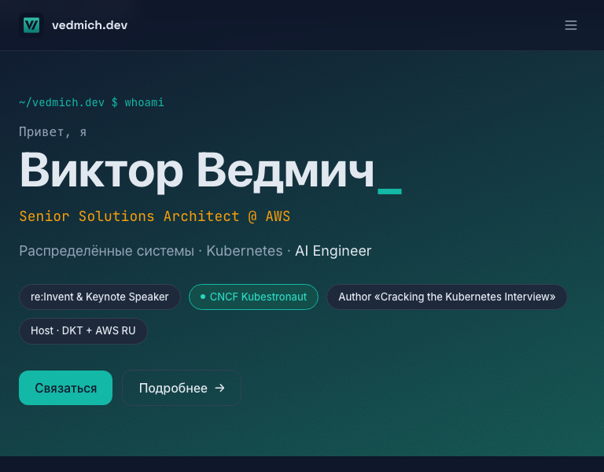
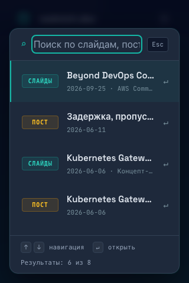

# Site and project review: 2026-10-03

## Scope and evidence

Reviewed application source, Content Collections, localization, search, static
metadata, responsive behavior, build/test setup, GitHub Pages publishing, and
Paseo project configuration. Started at `1e4a069`; preserved concurrent commits
`9d04594` and `c9f8f81`. Original-state browser comparisons used `9d04594` in an
isolated temporary worktree. Final local build includes 40 Astro routes.

This review changes local code and commits. It does not publish, trigger remote
CI, send contact messages, or certify production. Browser verification used
Playwright Chromium 147 on macOS, with EN/RU and widths 320, 390, 768, 1024, 1440.

## Fixed findings

| Priority | Finding and evidence | Result |
| --- | --- | --- |
| P1 | At 768px, header search/language controls extended to x=890 and became inaccessible. | Desktop navigation starts at 1280px; narrower screens get an accessible menu, expanded state, Escape handling, and bounded scrolling. |
| P1 | An EN-only unlisted post generated a nonexistent RU URL in navigation and hreflang. | Collection-aware alternate URLs; fallback to the localized collection index; unlisted pages emit no hreflang. |
| P1 | The root redirect accessed localStorage before navigation; a SecurityError stranded visitors. | Storage is optional; browser-locale routing and language-switch links survive blocked storage. |
| P1 | Search had no combobox/active-option semantics; its fixed layout exceeded short screens. | Native modal dialog, focus isolation/restoration, announced selection/count, keyboard scrolling, localized count, and a 320x480-safe layout. |
| P2 | Search hover could override keyboard selection when rendering under a stationary cursor. | Select on actual pointer movement without recreating result nodes on hover. |
| P2 | Search index JSON was written raw into a script element. A literal closing script tag in authored text could terminate it. | Escape `<` as `\u003c`; preserve text escaping in result markup. |
| P2 | Repeated navigation had no skip link; the Hello World article emitted two H1 headings. | Added localized skip link and corrected EN/RU article heading structure. |
| P2 | Fixed-width book links could exceed narrow article containers. | Bound link/image width to available space; verified the unlisted article at 320px without page overflow. |
| P2 | Broken non-deck URLs immediately redirected home, obscuring the error. | A real 404 recovery page retains the URL; EN/RU links remain usable without JS. Slidev deep-link shell loading remains intact. |
| P2 | All 14 blog article pages lacked og:image despite requesting a large Twitter card. No robots.txt existed. | Default 1200x630 branded PNG, cover_image override, Open Graph/Twitter image metadata, article type/date, machine-readable time, and sitemap discovery in robots.txt. |
| P1 | Playwright's default discovery imported Node unit tests while listing browser tests. CI did not run tests. | Restrict browser discovery to `*.spec.ts`; add production smoke checks and unit gates to PR/branch checks and publication workflow. |
| P2 | Eight of nine screenshot baselines already failed on original HEAD. Fixed navigation obscured prose screenshots; waits used a guessed 300ms. | Inspected original/expected comparisons, wait for document.fonts.ready, hide the header for prose captures, refresh reviewed macOS baselines, then verify without updating. |
| P1 | No AGENTS.md existed; CLAUDE.md contained obsolete content/deck paths and publishing instructions. README was the Astro starter template. | Canonical AGENTS.md, short Claude import, current README, and focused development/content runbooks. Verified actual discovery in a fresh read-only Codex session. |
| P1 | Paseo had no project scripts or automatic worktree setup. | Portable paseo.json, lockfile install, Astro types, matching Chromium, services, verification commands, and metadata guidance. Removed numeric per-script ports after proving they override automatic allocation. |

## Project setup

`npm run setup` and Paseo's worktree hook execute `scripts/setup-worktree.sh`.
Node 22 stays aligned with existing CI. Setup installs existing dependencies
only, generates types, and prepares Chromium. `SKIP_BROWSER_INSTALL=1` skips the
browser download. It does not copy secrets, share node_modules, move the Slidev
pin, or install privileged OS packages.

Paseo exposes dev, preview, build, unit-tests, smoke-tests, visual-tests, and
deploy-script-tests. The setup is committed, so new worktrees inherit it.
Services use the allocated PASEO_PORT; new dynamic allocations use 4400-4499.
The current workspace title is `Site review and worktree setup`. Auth, provider
routing, and desktop trust remain machine-local.

Both verification workspaces were archived after acceptance. Temporary baseline
checkout/processes were removed. The main dev service remains available in Paseo;
no verification-only workspace or branch is needed for normal use.

The Astro-only preview intentionally excludes deck artifacts. The development
runbook documents preparation of the complete whitelisted output. No deploy
command runs as a setup/teardown hook.

## Remaining recommendations

1. **Prioritize a dependency migration.** Live `npm audit` for the committed
   lockfile reported 22 affected packages: 2 critical, 18 high, 2 low. Direct
   packages include Astro 5.18.0, astro-icon 1.1.5, MDX 4.3.14, and sharp 0.34.5.
   Audit proposes major remediation for Astro/MDX and sharp; do not run
   `npm audit fix --force` without a compatibility plan. Test the content pipeline,
   SVG exporter, Shiki palette, routing, and screenshots during migration.
   GitHub Pages serves static files, so SSR/server-island advisories do not by
   themselves establish a production exploit. Build tools, local development,
   SVG processing, and authored HTML still warrant review. No dependency upgrades
   were mixed into this change.
2. **Add a real type-check gate with approval for tooling dependencies.** Astro
   build is successful, but `@astrojs/check`/TypeScript are not configured as a
   supported check command. No claim of full type-check or lint acceptance is made.
3. **Make Cyrillic typography deterministic.** Current font files are Latin
   subsets. Chromium's platform-font inspection of the RU About heading showed
   six glyphs rendered by the system SF font and one by Space Grotesk. Select an
   appropriate self-hosted Cyrillic family/subset before treating cross-platform
   RU screenshots as visually identical. This needs a typography choice, not a
   permissive screenshot threshold.
4. **Replace the draft sitemap parser when extending content visibility.** It
   still scans top-level blog files with a frontmatter regex. Nested content or
   `draft: true # comment` can escape that URL filter; speaking drafts also need
   a unified policy before use. Existing current draft URLs were checked and are
   absent from sitemap/search/listings. noindex is not confidentiality.

## Verification

| Check | Evidence |
| --- | --- |
| Production build | Pass, 40 Astro routes, no build errors |
| Unit baseline | 69 passed; unchanged unit-test subjects remain covered |
| Deployment helpers | 76 passed, including YAML and whitelist checks |
| Functional browser suite | 20 passed |
| Complete browser command | 29 passed with an independently started production preview |
| Reviewed visual baselines | 9 passed without snapshot updates after final capture normalization |
| Internal authored links/assets | Static scan of generated pages found no missing first-party targets outside the explicitly excluded Slidev surface |
| Clean worktree bootstrap | npm ci, astro sync, Chromium preparation, and build passed in a separate checkout |
| AGENTS discovery | Fresh ephemeral read-only Codex session named AGENTS.md and its setup/draft/Slidev/publication rules |
| Paseo runtime | Managed worktree setup ran automatically. Worktree dev/preview used 4427/4487, while main dev used 4470. All three proxy URLs returned HTTP 200 concurrently; worktree services reported healthy. |
| Production deployment | Not run |

The Slidev 404 regression test uses an intercepted test shell to verify URL/query
preservation. It is not an end-to-end check of every deployed deck. External
social URLs, mail delivery, field accessibility with a screen reader, Linux image
baselines, and real-user Core Web Vitals were not certified by this local review.

## Visual evidence

The default social card is [og-default.png](../../public/og-default.png).

## Instruction source

Codex discovery was checked against the fetched official
[AGENTS.md documentation](https://learn.chatgpt.com/docs/agent-configuration/agents-md)
and a fresh local session. AGENTS.md is under 8 KiB; no global configuration,
fallback filename, trust setting, or provider route was changed.
